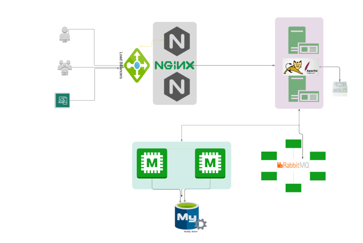
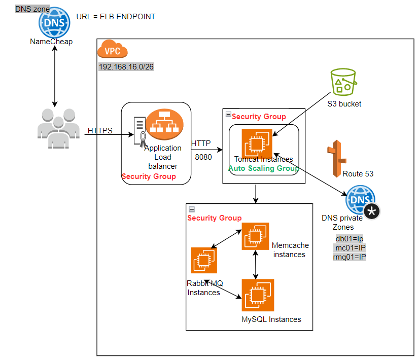
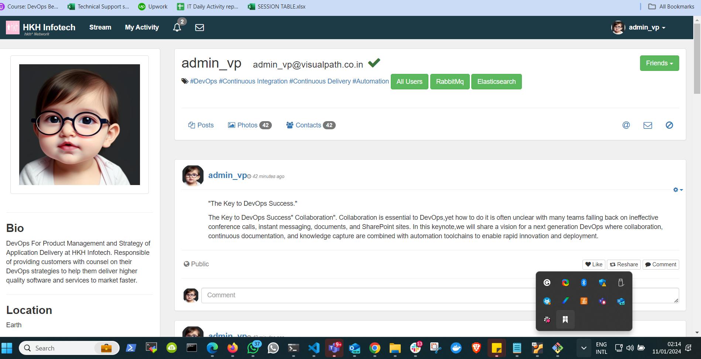

# LIFT AND SHIFT STRATEGY FOR HOSTING A MULTI TIER WEB JAVA APPLICATION STACK ON AWS 

**Design on VM based datacenter, automating with vagrant and bash scipt**

### Design on private data powered by virtual box



### Design-on-AWS-platform



PROJECT EXECUTION FLOW

1. Login to AWS Account
2. Create Key Pairs
3. Create Security Groups
4. Lauch instances with user data (Bash scripts)
5. Update IP to name mapping in route 53
6. Build Application from source code
7. Upload built application to S3 bucket
8. Download artifact to Tomcat Ec2 Instance
9. Setup ELB with https (cert from Amazon Certificate Manager)
10. Map ELB Endpoint to website name in DNS provider (Namecheap)
11. Verify that you can access the site
12. Build Autoscaling group for Tomcat instances.

## Infractructures:

Each of the instance has its  [user data script here](user-data-script)
1. EC2 instance (ubuntu) for Tomcat webserver
2. EC2 instance (CentOS9) for DB server
3. EC2 instance (CentOS9) for RabbitMQ
4. EC2 instance (CentOS9)for Memcache
5. Elastic load balancer instead against nginx LB used in private DC
6. S3 service
7. Amazon Cert Manager

## Create Security Groups
* Frontend: ALB security group: https port (443),80 Tomcat security group: 8080
* Backend: Mysql (3306); memcache (11211), RabbitMQ (5672)

Name Cheap dns: smile-boma.site

For communications between the backend applications, A route 53 private dns was created with simple A record. Private IPs of the servers were used against editing /etc/hostname and /etc/hosts on local DC.

### Building the Artfact

Source [code](src) was clone to my windows workstation using gitbash.

I also ensured that jdk 11 and mavin is install on my windows workstation/\.

Then I cd into the folder containing the [code](src) and ran:

```markdown
mvn install
```
The above command build the source code into artifact, although, the folder created is called 'target', but what is actually needed is .war file. But before this built, ensure the [properties-file](src/main/resources/application.properties) is edited with the necessary parameters.

### Sending the artifact into s3 Bucket

1. Go to aws create IAM user with full s3 permission, create programmatic access which will allow you to us awscli.
2. In IAM console, also create an EC2 role (full s3 permission) that will be attached to tomcat server, this will make it possible to copy the artifact from s3 to tomcat server for deployment.
3. On the command line, create s3 bucket, and send the .war artifact to the s3 bucket.

### Deploying Application in tomcat server

1. copy the artifact from s3 to tomcat instance

2. stop the tomcat service, delete the default /var/lib/tomcat9/webapps/ROOT

3. Copy /tmp/vprofile-2.war and rename to /var/lib/tomcat9/webapps/ROOT.war.

4. Start tomcat service again, when that is done, a ROOT folder will be created again from the .war file.

Finally, the website can be viewed through the ALB url, or better still you can purchase a domain name from any provider, and create SSL/tls Certificate in aws, then create a cname record in the domain provider environment. Then the website can now be accessed through the purchased fully qualified dns.

Please find the site below:





